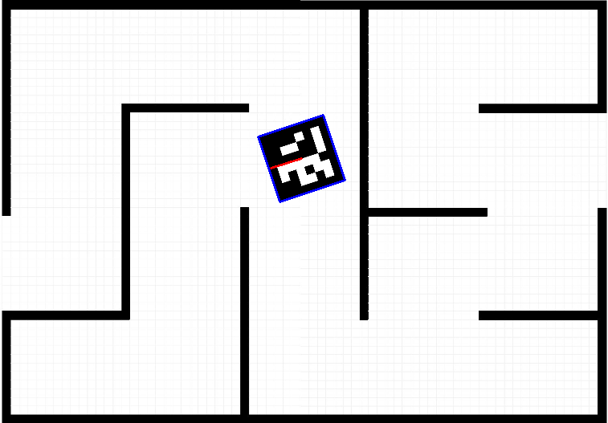
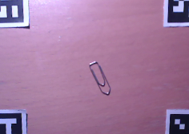

# labyrinth-project
Project for Mobile Robotics

Main: [main_script.py](main_script.py)

vision_utils
------------

```python
detect_aruco(img)
get_pos_aruco(img, detected, search_id)
localize_thymio(img, detected)
erase_aruco(img, detected)
detect_labyrinth(img, wall_size)
get_labyrinth_perspective(img)
crop_labyrinth(img, M)
calibrate_corners(cam)
```

generate_aruco.py
-----------------

Generate AruCo

No module named "cv2.aruco" : https://stackoverflow.com/questions/45972357/python-opencv-aruco-no-module-named-cv2-aruco

## ArUco


## Labyrinth layout


## Localize ArUco



## Detect Labyrinth


In ~ 12 ms

## Detect corners



